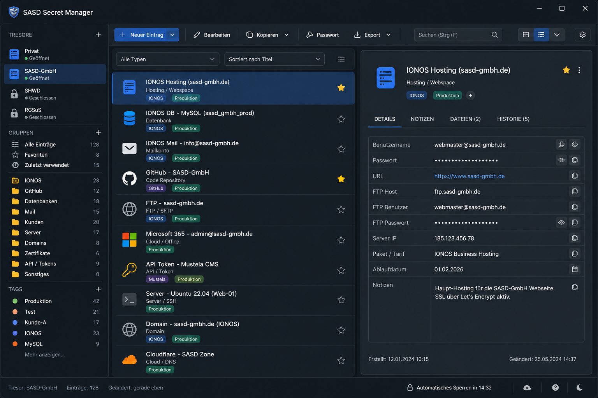

# SASD Desktop Secret Manager


**SASD Desktop Secret Manager** ist ein lokal orientierter Desktop-Secret-Manager für Windows auf Basis von **C# / .NET 8** und **WinForms**.

Das Projekt verfolgt bewusst nicht das Ziel, nur eine einfache Passwortliste oder einen vollständigen 1:1-Klon von Password Safe nachzubauen. Ziel ist ein eigenständiger, sicherheitsbewusster Secret Manager mit mehreren unabhängigen Tresoren, strukturierter Verwaltung technischer Zugangsdaten, realistischer Password-Safe-Interop und einem führenden internen Datenmodell.

> **Status:** Aktiver Entwicklungsstand mit lauffähigem WinForms-Prototyp, sauberer Projektstruktur, verschlüsseltem `.svault`-Format, Gruppen-/Tag-Modell, Suche, Detailansicht, Drag-and-Drop und automatisierten Tests.  
> **Noch nicht für produktive Geheimnisse freigeben:** Clipboard-Schutz, Auto-Lock, Passwortgenerator, Password-Safe-Import, Zertifikatsfunktionen und Release-Härtung sind noch nicht vollständig abgeschlossen.

## Inhaltsübersicht

- [Ziel des Projekts](#ziel-des-projekts)
- [Visuelle Richtung](#visuelle-richtung)
- [Warum mehr als ein Passwortmanager?](#warum-mehr-als-ein-passwortmanager)
- [Kernkonzepte](#kernkonzepte)
- [Geplante Secret-Typen](#geplante-secret-typen)
- [HTTPS-/TLS-Zertifikatsverwaltung](#https-tls-zertifikatsverwaltung)
- [Aktueller Entwicklungsstand](#aktueller-entwicklungsstand)
- [Noch offene Themen bis V1](#noch-offene-themen-bis-v1)
- [Roadmap-Kurzfassung](#roadmap-kurzfassung)
- [Sicherheitsmodell und Grenzen](#sicherheitsmodell-und-grenzen)
- [Architekturüberblick](#architekturüberblick)
- [Projektstruktur](#projektstruktur)
- [Voraussetzungen](#voraussetzungen)
- [Build, Test und Start](#build-test-und-start)
- [Dokumentation](#dokumentation)
- [Repository-Strategie](#repository-strategie)
- [Nicht-Ziele](#nicht-ziele)
- [Lizenz](#lizenz)

## Ziel des Projekts

Der SASD Desktop Secret Manager soll eine lokal nutzbare Windows-Anwendung werden, mit der persönliche, betriebliche und projektbezogene Secrets sicher, strukturiert und nachvollziehbar verwaltet werden können.

Wichtige Ziele sind:

- lokale Nutzung ohne Cloud-Zwang,
- mehrere voneinander unabhängige Tresore,
- ein verschlüsseltes internes Tresorformat (`.svault`),
- strukturierte Einträge für technische und organisatorische Secrets,
- Gruppen, Tags, Suche und Filter zur Wiederauffindbarkeit,
- bewusste Reveal-/Copy-Aktionen für sensible Werte,
- Schutz gegen Datenverlust durch robuste Speicher- und Backup-Strategien,
- realistische Interoperabilität mit Password Safe (`.psafe3`),
- eine ruhige, professionelle Windows-Desktop-Oberfläche,
- gut dokumentierter und gut wartbarer C#-Code.

Das Projekt wird aktuell als persönliches Entwicklungs-Repository geführt. Spätere, bereinigte Release-Stände können separat in ein SASD-GmbH-Repository übernommen oder gespiegelt werden.

## Visuelle Richtung



Die Anwendung folgt einer ruhigen Desktop-Oberfläche mit Drei-Zonen-Layout:

- links Tresor-, Gruppen- und Navigationsbereich,
- mittig Such-, Filter- und Ergebnisbereich,
- rechts Detailansicht des ausgewählten Eintrags.

Die Oberfläche soll eher wie ein professionelles Verwaltungswerkzeug wirken als wie eine bunte Consumer-App. Kontextmenüs, klare Dialoge, sichere Standarddarstellung und eine nachvollziehbare Statuszeile sind wichtiger als visuelle Effekte.

## Warum mehr als ein Passwortmanager?

In der Praxis bestehen viele Zugangsdaten nicht nur aus Benutzername und Passwort. Gerade im SASD-Umfeld gehören oft zusätzliche technische Informationen dazu:

- Hostname oder IP-Adresse,
- Port,
- Protokoll,
- Datenbankname,
- Schema,
- Umgebung wie Entwicklung, Test oder Produktion,
- Provider oder Mandant,
- API-Endpunkt,
- Zertifikatsbezug,
- Ablaufdaten,
- Rollen- oder Rechtehinweise,
- organisatorische Notizen.

Ein klassisches Passwortschema mit Titel, Benutzername, Passwort und URL reicht dafür nicht aus. Deshalb behandelt der SASD Desktop Secret Manager einen Eintrag als fachlich beschriebenes Secret-Objekt mit Typ, Gruppe, Tags, Notizen und strukturierten Zusatzfeldern.

## Kernkonzepte

| Konzept | Bedeutung |
| --- | --- |
| **Vault / Tresor** | Eine eigenständige verschlüsselte Datei mit eigenem Master-Passwort und eigenen KDF-/Formatparametern. |
| **Entry / Eintrag** | Ein einzelner fachlicher Zugang oder ein einzelnes Secret, z. B. Login, Datenbank, API-Key oder Zertifikat. |
| **Group / Gruppe** | Hierarchische Ablage zur organisatorischen Strukturierung. Ein Eintrag hat genau eine Hauptgruppe. |
| **Tag** | Flexible Quermarkierung, z. B. `SASD`, `IONOS`, `Produktion`, `GitHub`, `TLS`, `Kunde`. |
| **CustomField / Zusatzfeld** | Strukturierte Zusatzinformation wie Host, Port, Endpoint, Fingerprint oder Zertifikatsablauf. |
| **Sensitive Field** | Ein Feld, dessen Inhalt standardmäßig maskiert und beim Kopieren besonders behandelt wird. |
| **Interop** | Additive Import-/Export-Schicht zu Fremdformaten wie Password Safe, ohne das interne Modell zu beschneiden. |

Die Grundregel lautet: **Das interne Datenmodell ist führend.** Fremdformate, Importwege und spätere Exportfunktionen müssen sich nachvollziehbar auf dieses Modell abbilden lassen.

## Geplante Secret-Typen

Mindestens folgende Eintragstypen sind im Zielbild vorgesehen:

| Typ | Typische Inhalte |
| --- | --- |
| **Login** | Web- und Portalzugänge mit URL, Benutzername, Passwort und Notizen. |
| **Mail** | E-Mail-Adresse, IMAP-/SMTP-Hosts, Ports, TLS-Informationen, Benutzername, Passwort. |
| **Database** | Host, Port, Datenbankname, Schema, Benutzer, Passwort, SSL/TLS-Hinweise. |
| **Hosting** | Providerzugang, Kunden-/Vertragsbezug, Backend-URL, technische Hinweise. |
| **FTP/SFTP** | Host, Port, Protokoll, Zielpfad, Benutzer, Passwort oder Schlüsselhinweis. |
| **API** | Client-ID, Secret, Token, Endpoint, Scope, Rechte- oder Ablaufhinweise. |
| **Server** | Hostname/IP, Protokoll, Port, Benutzer, Authentifizierungsart, Rollenhinweise. |
| **License** | Produkt, Lizenzschlüssel, Hersteller, Ablaufdatum, Vertrags- oder Bestellbezug. |
| **Certificate / TLS** | HTTPS-/TLS-Zertifikate, Domains, SANs, Fingerprints, Ablaufdaten, private Schlüssel/PFX-Bezüge. |
| **SecureNote** | Freier sicherer Text, wenn keine stärkere Typisierung sinnvoll ist. |
| **Custom** | Sonderfälle, die nicht sauber in vorhandene Typen passen. |

Die Typen sollen die Eingabe unterstützen, aber das Modell nicht zu starr machen. Zusatzfelder bleiben bewusst flexibel.

## HTTPS-/TLS-Zertifikatsverwaltung

Durch die fortgeschriebenen Projektunterlagen ist die Verwaltung von HTTPS-/TLS-Zertifikaten als eigener fachlicher Themenbereich aufgenommen worden.

### Zielbild

Die Anwendung soll Zertifikate nicht nur als unstrukturierte Notiz speichern, sondern als eigenen Secret-Kontext verwalten können. Ein Zertifikatseintrag soll im Zielbild unter anderem folgende Informationen aufnehmen können:

- Domain oder Dienstbezug,
- Subject / Common Name,
- Subject Alternative Names,
- Issuer,
- Seriennummer,
- Fingerprint,
- Gültig-von- und Gültig-bis-Datum,
- Zertifikatstyp, z. B. Serverzertifikat, Clientzertifikat, CA-Zertifikat,
- Umgebung, z. B. Entwicklung, Test, Produktion,
- Provider oder Aussteller,
- Pfad- oder Ablagehinweise,
- Passphrase für private Schlüssel oder PFX-Dateien,
- Verweis auf private Schlüssel, CSR, Chain-Dateien oder PFX/PKCS#12-Dateien.

### Sicherheitslinie

Private Schlüssel, PFX-Passwörter, Token und vergleichbare Werte sind als sensible Inhalte zu behandeln. Sie dürfen nicht ungefragt sichtbar sein, nicht im Klartext geloggt werden und müssen beim Kopieren über dieselben Schutzmechanismen laufen wie Passwörter und API-Secrets.

Für frühe Versionen ist wichtig:

- Zertifikatsdaten werden zunächst als strukturierte Einträge und Zusatzfelder modelliert.
- Binäranhänge wie echte PFX-/DER-Dateien werden nicht unüberlegt in den V1-Kern gedrückt.
- Ablaufwarnungen sind sinnvoll, gehören aber erst in eine Härtungs- oder Komfortstufe.
- ACME-/Let's-Encrypt-Automation, CSR-Erzeugung, Zertifikatsrollout und PKI-Workflows sind spätere Spezialthemen.
- Das Produkt soll kein vollwertiges PKI-Management-System ersetzen.

## Aktueller Entwicklungsstand

Der aktuelle Stand deckt wesentliche Teile des geplanten V1-Fundaments bereits ab.

### Bereits umgesetzt

- lauffähige WinForms-Anwendung auf .NET 8,
- getrennte Solution-Struktur mit Domain, Application, Security, Storage, Interop und UI,
- internes Tresorformat (`.svault`) mit verschlüsseltem Speichern und Laden,
- atomische Speicherlogik mit Backup-Grundlage,
- neue Tresore anlegen,
- Tresore öffnen,
- speichern / speichern unter,
- Passwortdialoge,
- Gruppen und Untergruppen,
- sichtbarer Root-/Tresorknoten,
- Einträge anlegen, bearbeiten und löschen,
- strukturierte Detailansicht,
- Tags und Tag-Interaktionen,
- Suche und Sortierung,
- Drag-and-Drop für Einträge,
- Drag-and-Drop für Gruppen,
- Schutz gegen ungültige Gruppenverschiebungen und Zyklen,
- Rückfragen bei riskanteren Organisationsoperationen,
- Dirty-Tracking für ungespeicherte Änderungen,
- Warnung bei schwachen Master-Passwörtern,
- Debug-Konsole und Entwicklungslogging,
- automatisierte Tests für wichtige Domain-, Application-, Security-, Storage- und Interop-Grundlogik.

### Einordnung

Der Prototyp ist damit deutlich mehr als eine leere Oberfläche. Er ist aber noch **kein produktiv freigegebener Passwortmanager**. Für echte Secrets fehlen insbesondere Abschluss und Review der Sicherheits- und Komfortfunktionen.

## Noch offene Themen bis V1

Für eine runde V1 sind insbesondere folgende Themen noch sauber abzuschließen:

- Clipboard-Autoclear für sensible Copy-Aktionen,
- klares Copy-Feedback in Statusleiste und UI,
- konsequente Trennung zwischen sensiblen und nicht-sensiblen Copy-Aktionen,
- Schutz gegen Datenverlust bei Neu, Öffnen, Schließen und Beenden,
- Lock-/Unlock-Workflow für geöffnete Tresore,
- Auto-Lock nach Inaktivität,
- Master-Passwort ändern und Tresor neu verschlüsseln,
- robusteres Backup- und Konfliktverhalten,
- Passwortgenerator,
- Generatorprofile,
- Eintragsvorlagen für typische Secret-Typen,
- alltagstauglichere Suche und Filter,
- Zertifikatseinträge als strukturierter Secret-Typ,
- Password-Safe-Import (`.psafe3`) mit Mapping- und Importbericht,
- Release-Härtung, Dokumentation, README, Screenshots und Benutzerkurzdokumentation.

## Roadmap-Kurzfassung

Die detaillierte Roadmap befindet sich in der Projektdokumentation. Kurz zusammengefasst:

| Stufe | Ziel | Typische Inhalte |
| --- | --- | --- |
| **Aktueller Stand** | Technisches Fundament | `.svault`, Grund-UI, Gruppen, Tags, Suche, Einträge, Drag-and-Drop, Tests. |
| **V1** | Runde lokale Erstversion | Clipboard-Schutz, Auto-Lock, Passwortgenerator, Vorlagen, Zertifikatstyp, `.psafe3`-Import, Release-Härtung. |
| **V1.x** | Härtung und Alltagstauglichkeit | Erweiterte Backups, Tag-Verwaltung, bessere Importberichte, Zertifikatsablaufwarnungen, Produktpolitur, Icon. |
| **V2** | Funktionsausbau | Mehrsprachigkeit, Themes, Cross-Vault-Komfort, Passwort-Historie, optionale Leak-Prüfung, CSV-Export mit Warnung. |
| **V3/später** | Spezial- und Onlinefunktionen | Browser-Import, tiefere Interop, ACME-/PKI-Automation, mögliche spätere Team-/Sync-Konzepte. |

Die Projektlinie bleibt: **erst lokal, robust und nachvollziehbar; dann Komfort; dann Interop; dann spätere Spezialfunktionen.**

## Sicherheitsmodell und Grenzen

Das Projekt ist sicherheitskritisch. Deshalb werden Sicherheitsversprechen bewusst vorsichtig formuliert.

### Das Produkt soll schützen gegen

- Verlust oder Diebstahl einer Tresordatei,
- neugieriges Mitlesen am Arbeitsplatz durch sichere Standardanzeige,
- versehentliche Offenlegung durch dauerhaft gefüllte Zwischenablage,
- unsichere oder unklare Speicherung,
- Datenverlust durch halbfertige Schreibvorgänge,
- unkontrollierte Logs mit sensiblen Inhalten,
- stille Datenverluste bei Import oder Migration.

### Das Produkt schützt nicht vollständig gegen

- ein bereits kompromittiertes Windows-System,
- Malware mit Benutzerrechten,
- Keylogger,
- aggressive RAM-Auslese,
- manipulierte Betriebssystem- oder Treiberumgebungen,
- kompromittierte Build- oder Installationswege.

### Sicherheitsprinzipien

- Kein Master-Passwort wird gespeichert.
- Keine Secrets in Logs.
- Keine Klartext-Tempdateien für sensible Inhalte.
- Sensible Werte sind standardmäßig maskiert.
- Reveal und Copy sind bewusste Aktionen.
- Clipboard-Autoclear ist Pflicht für sensible Copy-Aktionen.
- Backups müssen denselben Schutzanspruch erfüllen wie die Hauptdatei.
- Keine versteckte Recovery-Backdoor.
- Unsichere Exporte wie CSV nur mit ausdrücklicher Warnung und separater Entscheidung.

Weitere Details sollen in einem eigenen Security-/Threat-Model-Dokument gepflegt werden.

## Architekturüberblick

Die Anwendung ist bewusst in Schichten getrennt:

| Schicht | Verantwortung |
| --- | --- |
| **Domain** | Fachliche Kernobjekte wie Vault, Entry, Group, Tag, CustomField und Enums. |
| **Application** | Anwendungslogik, Such-/Filterlogik, Mutationen, Organisationsregeln, spätere Use Cases. |
| **Security** | Kryptografie, Passwortbewertung, Clipboard-Schutz, Locking, Redaction-Regeln. |
| **Storage** | Internes `.svault`-Format, Laden/Speichern, atomische Dateioperationen, Backups, Migrationen. |
| **Interop.PasswordSafe** | Import/Export-Logik für Password Safe, Mapping, Importberichte, spätere Writer. |
| **WinForms / UI** | Hauptfenster, Dialoge, Detailansicht, TreeView/ListView, Statusleiste und Benutzerinteraktion. |
| **Tests** | Unit-, Integrations- und Negativtests für die jeweiligen Schichten. |

Die UI soll keine kryptografischen Details kennen. Die Storage-Schicht soll keine konkreten Forms kennen. Das Domain-Modell bleibt frei von UI- und Dateisystemlogik.

## Projektstruktur

```text
SASD-Desktop-Secret-Manager/
├── assets/
│   └── readme/
├── docs/
│   ├── architektur/
│   ├── decisions/
│   ├── lastenheft/
│   ├── pflichtenheft/
│   └── README.md
├── src/
│   ├── Sasd.SecretManager.Application/
│   ├── Sasd.SecretManager.Domain/
│   ├── Sasd.SecretManager.Interop.PasswordSafe/
│   ├── Sasd.SecretManager.Security/
│   ├── Sasd.SecretManager.Storage/
│   └── Sasd.SecretManager.WinForms/
├── tests/
│   ├── Sasd.SecretManager.Application.Tests/
│   ├── Sasd.SecretManager.Domain.Tests/
│   ├── Sasd.SecretManager.Interop.PasswordSafe.Tests/
│   ├── Sasd.SecretManager.Security.Tests/
│   └── Sasd.SecretManager.Storage.Tests/
├── tools/
│   └── README.md
├── Directory.Build.props
├── global.json
└── SASD-Desktop-Secret-Manager.sln
```

## Voraussetzungen

Empfohlene Entwicklungsumgebung:

- Windows 10 oder Windows 11,
- .NET SDK 8.x,
- Visual Studio 2022 oder Visual Studio Code,
- Git,
- optional: GitHub Desktop oder ein anderer Git-Client.

Prüfen der installierten .NET-SDKs:

```bash
dotnet --list-sdks
```

## Build, Test und Start

Repository klonen:

```bash
git clone https://github.com/Robin-Goerlach/SASD-Desktop-Secret-Manager.git
cd SASD-Desktop-Secret-Manager
```

Abhängigkeiten wiederherstellen:

```bash
dotnet restore
```

Build ausführen:

```bash
dotnet build
```

Tests ausführen:

```bash
dotnet test
```

WinForms-Anwendung starten:

```bash
dotnet run --project src/Sasd.SecretManager.WinForms/Sasd.SecretManager.WinForms.csproj
```

Alternativ kann die Solution in Visual Studio 2022 geöffnet werden:

```text
SASD-Desktop-Secret-Manager.sln
```

## Dokumentation

Die Dokumentation ist ein wichtiger Teil des Projekts und nicht nur Beiwerk.

Wichtige Dokumentbereiche:

- [`docs/lastenheft/`](docs/lastenheft/) – fachliche Anforderungen und Zielbild,
- [`docs/pflichtenheft/`](docs/pflichtenheft/) – Umsetzungsspezifikation,
- [`docs/architektur/`](docs/architektur/) – Architektur, Schichten, Datenmodell und technische Entscheidungen,
- [`docs/roadmap.md`](docs/roadmap.md) – geplanter Weg bis V1 und darüber hinaus,
- [`docs/decisions/`](docs/decisions/) – Architekturentscheidungen / ADRs,
- [`SECURITY.md`](SECURITY.md) – Sicherheitshinweise und Meldeweg.

Sinnvolle zusätzliche Dokumente für die nächsten Schritte:

- Featuremap,
- Security-/Threat-Model,
- `.svault`-Dateiformat-Spezifikation,
- Test- und Abnahmekatalog V1,
- Import-/Export-Konzept für `.psafe3`, CSV und spätere Formate,
- UI-/UX-Konzept für Entry-Dialoge, Zertifikatsansicht und Copy-/Reveal-Verhalten.

## Repository-Strategie

Aktuell wird das Projekt unter dem persönlichen GitHub-Account entwickelt. Das ist für frühe Entwicklungsstände, Experimente, Lernfortschritte und schnelle Iterationen sinnvoll.

Später können bereinigte Stände:

- in ein Repository der SASD GmbH übernommen,
- als Release-Zweig gespiegelt,
- mit stabilerer Dokumentation versehen,
- mit Releases, Tags und Artefakten veröffentlicht werden.

Mehr dazu:

- [`docs/repository-strategy.md`](docs/repository-strategy.md)
- [`docs/repository-metadata.md`](docs/repository-metadata.md)

## Entwicklungsgrundsätze

Für dieses Projekt gelten die SASD Engineering Standards:

- kritisch analysieren, bevor Code geändert wird,
- V1 klein, robust und glaubwürdig halten,
- Security-, Datenschutz- und Missbrauchsrisiken früh bedenken,
- Architekturentscheidungen dokumentieren,
- Domain-, Security-, Storage- und UI-Verantwortung trennen,
- keine unnötige Komplexität vorziehen,
- Code gut kommentieren,
- XML-Kommentare für öffentliche und zentrale interne Typen verwenden,
- Tests für sicherheits- und dateibezogene Logik priorisieren,
- Dokumentation und Code begrifflich konsistent halten.

## Nicht-Ziele

Bewusst nicht Teil des frühen Kernumfangs sind:

- Cloud-Zwang,
- Team-Sharing,
- Multi-User-Rechteverwaltung,
- mobile Apps,
- Browser-Autofill,
- Plugin-System,
- vollständiger Password-Safe-1:1-Klon,
- versteckte Recovery-Backdoor,
- vollwertiges PKI-Management,
- automatische Zertifikatsausstellung und Rollout,
- Nutzung als produktiver Passwortmanager vor Abschluss der Härtung.

Diese Themen sind nicht vergessen. Sie werden nur bewusst nicht in den frühen Kern gedrückt.

## Sicherheitshinweis

Dieses Projekt ist ein sicherheitsrelevantes Entwicklungsprojekt. Solange Kryptografie, Dateiformat, Recovery-Konzept, Import/Export, Clipboard-Schutz, Auto-Lock, Zertifikatsverwaltung und weitere Härtungspunkte nicht vollständig abgeschlossen und geprüft sind, sollten keine echten produktiven Geheimnisse ausschließlich in frühen Entwicklungsständen verwaltet werden.

Für Tests sollten Demo-Daten oder bewusst unkritische Test-Secrets verwendet werden.

## Lizenz

Dieses Repository steht unter der **Apache License 2.0**.

Das Entwicklungs-Repository liegt derzeit unter dem persönlichen GitHub-Account von Robin Goerlach. Ausgewählte Release-Stände können später in Repositories der SASD GmbH gespiegelt oder übertragen werden.
